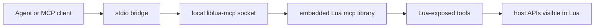
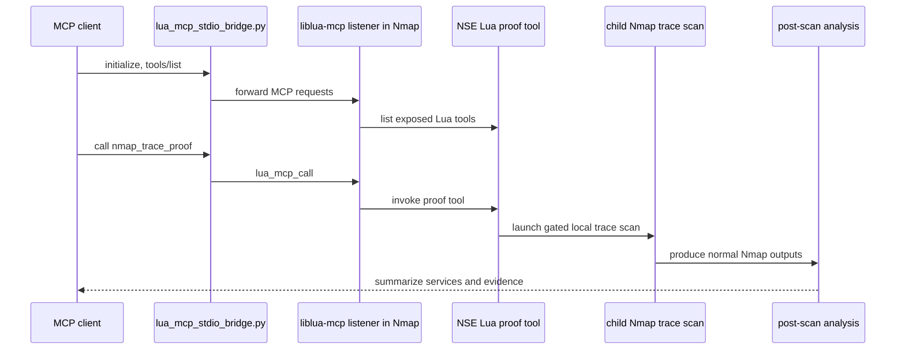

# Lua-Mediated Control: An Nmap Case Study in MCP Access for Embedded Lua Hosts

## Abstract

Many mature applications already embed Lua as their extension language. They
expose commands, callbacks, state, and domain objects to Lua so users can
automate host behavior without changing the host source tree. `liblua-mcp`
explores a narrow question: what if that existing embedded Lua surface could
also expose selected capabilities to agents through the Model Context Protocol
(MCP)?

The answer is not to make every host application implement MCP, redirect its
stdout, or surrender arbitrary process access. The `liblua-mcp` approach adds a
built-in Lua library named `mcp`. A Lua script can start a local listener,
register explicit tools with schemas, and let MCP clients call only those tools.
The MCP endpoint is owned by the Lua side; the host keeps its normal input,
output, lifecycle, and embedding model.

Nmap is a useful case study because its Nmap Scripting Engine (NSE) is already
Lua-based and already used to automate network discovery and service analysis.
In a local proof, an MCP client reached a live Nmap process through
`liblua-mcp`, invoked a Lua-exposed proof tool, caused an evidence-producing
Nmap scan, and verified the scan result while the MCP call was in flight. The
proof is small and deliberately local, but it demonstrates the larger
architectural point: embedded Lua can become a local agent-facing control plane
for host capabilities that Lua can already reach.

## 1. Problem

Modern agent systems need stable interfaces to software. The common pattern is
to write a new MCP server next to an existing application: a separate process
that shells out, calls an HTTP API, talks to a database, or scrapes some
reachable surface. That can work, but it often misses the strongest integration
point in applications that already embed a scripting language.

Lua is frequently embedded precisely because a host wants to be programmable.
The host decides what Lua can see: commands, events, configuration, network
state, media controls, scan context, proxy state, game APIs, editor commands,
or other domain-specific objects. That Lua boundary is not accidental. It is a
reviewed extension surface shaped by the host's existing architecture.

The missing piece is a standard way for agents to call selected Lua-visible
operations. Without that, each host needs its own agent bridge, each bridge has
to rediscover host semantics, and each implementation must decide how much of
the host is safe to expose. `liblua-mcp` treats the embedded Lua surface itself
as the natural place to draw the line: MCP can reach what Lua code explicitly
publishes, and no more.

## 2. Background

Lua is designed to be embedded. The official Lua documentation describes the
language, standard libraries, and C API; the C API allows host C code to
interact with Lua, register functions callable by Lua, and call Lua functions
from the host. In practice, hosts use that API to create a scripting surface
that is smaller and more domain-specific than the full host internals.

MCP provides a standard protocol for connecting clients and models to external
context and tools. MCP tools have names, descriptions, and input schemas, and
clients can list and invoke them. That makes MCP a good fit for explicit host
operations, as long as the exposed operations are bounded and auditable.

Nmap's NSE supplies the case-study host. The Nmap documentation describes NSE
as a Lua-based scripting engine for automating networking tasks, running scripts
in parallel with Nmap's scan engine. Nmap therefore already has the two
ingredients this experiment needs: a real application with useful behavior, and
an embedded Lua environment through which some of that behavior is scripted.

## 3. Architecture

`liblua-mcp` is a Lua fork that adds a built-in Lua module named `mcp`, loaded
with the normal Lua libraries. The library is disabled unless the host process
sets `LUA_MCP_ENABLE=1`. In control mode, Lua code can call
`mcp.expose_tool(name, schema, fn, opts)` to register explicit MCP tools. A
client can reach those tools through a local Unix socket, or through the
provided stdio bridge when the client expects stdio MCP transport.

The core architecture is intentionally local and layered:

The host application does not need to speak MCP on stdout. Its normal output
remains parseable as normal host output. The MCP listener is a side channel
owned by the Lua runtime.

There are two integration paths:

- Replacement path: build or relink a host against `liblua-mcp`, then use the
  host's existing Lua loading mechanism to run an adapter script.
- Host-cooperative path: a host includes `lmcp.h`, registers selected C-backed
  operations as MCP tools, and calls the liblua-mcp serve API directly.

The replacement path is useful because it can validate the model without asking
the host project to change its source code. The host-cooperative path is
cleaner for a first-class mode such as a future `nmap --mcp`, because the host
can own lifecycle, initialization, and command scheduling directly while still
delegating MCP transport and tool plumbing to `liblua-mcp`.

## 4. Nmap Case Study

The Nmap proof used the replacement path. A custom Nmap build linked against a
Lua 5.4.8-compatible `liblua-mcp` branch. An NSE activator script started a
local liblua-mcp listener and exposed a proof tool. A Python harness then used
`tools/lua_mcp_stdio_bridge.py` to speak MCP over stdio while the bridge
forwarded requests to the Nmap-owned Unix socket.

The proof did not call the system `nmap` binary directly from the agent. The
agent reached a live custom Nmap process through MCP, listed the tools exposed
by the embedded Lua runtime, invoked `nmap_trace_proof`, and received metadata
about the scan result.

The scan target was restricted to loopback proof services. One service returned
a distinctive TCP banner; the other served a small HTTP page with a distinctive
title. This kept the proof free of third-party network effects while still
exercising the Nmap paths that matter for agentic service analysis: service
version detection, NSE script execution, trace capture, and structured output.
The proof harness recorded MCP traffic separately from Nmap output so that the
control interaction could be evaluated independently from the scan result.

The local proof recorded a passing assertion set. The MCP transcript showed
client initialization, tool listing, and a proof-tool call. The scan produced
normal Nmap outputs and a separate evidence timeline. The timeline showed host
outputs appearing before the MCP scan call returned, which is important: the
agentic interaction and the host-generated evidence were concurrent parts of
the same operation.

The Nmap result identified both local proof services. One was a plain TCP
service with a distinctive banner, and the other was an HTTP service whose
title was extracted by NSE. That is enough to show agent-triggered service
analysis through the Lua-mediated path without publishing lab identifiers,
private network targets, or raw trace material in the public repository.

The key result is not merely that an agent can run a command named `nmap`.
Command execution alone would not prove the project thesis. The result is that
an MCP client can reach an Nmap-owned embedded Lua runtime, discover
Lua-exposed tools, invoke a tool through liblua-mcp, and then analyze
host-generated artifacts. That is the control-plane pattern.

The evidence separates three layers that are often conflated in agent
integrations. The MCP transcript proves client-to-tool interaction. The exposed
Lua tool proves that the host's embedded Lua runtime mediated the request. The
Nmap artifacts prove that host work happened and produced normal Nmap outputs.
Keeping those layers distinct makes the experiment auditable and helps avoid
overstating what has been proven.

## 5. Security Boundary

The project boundary is deliberately narrower than unrestricted process
control.

First, `liblua-mcp` is disabled by default. The host process must opt in with
`LUA_MCP_ENABLE=1`. Control tools require `LUA_MCP_CONTROL=1`. Hazardous tools,
such as eval-style Lua execution, require a separate loud acknowledgement gate.

Second, MCP clients can call only registered tools. A Lua-visible host API does
not automatically become an MCP tool. Lua code must wrap and expose it with a
schema. This matters because the Lua scripting surface is already a boundary
chosen by the host, and the MCP surface should be a further narrowing of that
boundary.

Third, process-level launchers are a distinct risk class. The current Nmap
adapter includes gated local-lab tools that can spawn a local Nmap subprocess
for agent-requested scans or NSE scripts. Those tools are useful for proof and
experimentation, but they are not the same as embedded state inspection. They
must remain separately gated, explicit, and auditable.

Fourth, transport is local. The initial transport is a Unix socket with
restrictive permissions, with stdio available through a bridge process. This is
appropriate for trusted local lab work and architectural review. It is not a
production security claim.

## 6. Implications for Lua Embedders

For Lua embedders, the most important implication is that MCP integration does
not have to begin as a new host-native protocol implementation. If a host
already embeds Lua and already exposes useful operations to Lua, an adapter can
map selected operations into MCP tools.

That produces a useful adoption ladder:

1. Prove the concept with the replacement path and a Lua activator.
2. Move host-specific semantics into a reviewed adapter script.
3. Add explicit gates and schemas for every operation.
4. If the integration is valuable, consider a host-cooperative mode that calls
   `lmcp.h` directly.

The host-cooperative mode is the cleaner long-term form. For Nmap, that could
mean a mode that initializes NSE Lua, registers scan and script operations,
starts a local MCP listener, and waits for agent input. In that design, Nmap
would own its lifecycle and execution policy, while `liblua-mcp` would provide
the MCP transport, request parsing, and tool dispatch.

The same pattern can apply outside network scanning. HAProxy can expose
selected proxy and server state through its Lua `core` API. mpv can expose
player state and controls through its Lua API. Game engines, editors, test
harnesses, observability agents, and automation-heavy tools can use the same
shape when Lua is already their extension layer.

## 7. Future Work

The current alpha should be treated as trusted local research infrastructure.
The next work is to make the boundary easier to review:

- stabilize tool schemas, structured returns, and error reporting;
- improve local socket discovery without weakening locality;
- keep host-specific behavior in adapters unless it belongs in generic Lua;
- document replacement-path and host-cooperative patterns separately;
- expand proof targets only when they show a new host/Lua relationship;
- develop stronger safety guidance for process-level launchers.

The Nmap case study is enough to justify further work because it proves the
mechanism under a real Lua-embedded host. It is not enough to claim production
readiness. The value of the experiment is architectural: embedded Lua can be
more than a plugin language. With explicit gates and tools, it can be a local
MCP control layer for software that already chose Lua as its programmable
surface.

## References

- Model Context Protocol specification, version 2025-06-18:
  <https://modelcontextprotocol.io/specification/2025-06-18>
- Model Context Protocol tools documentation:
  <https://modelcontextprotocol.io/specification/2025-06-18/server/tools>
- Lua documentation: <https://www.lua.org/docs.html>
- Lua C API overview: <https://www.lua.org/pil/24.html>
- Nmap Scripting Engine manual: <https://nmap.org/book/man-nse.html>
- Nmap NSE language documentation: <https://nmap.org/book/nse-language.html>
